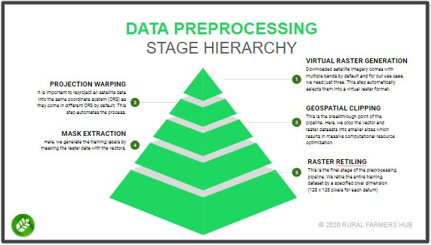

# Geospatial Data Preprocessing Toolbox ( geo-p )

### A pipeline solution for preparing geospatial data for Machine Learning.

These toolbox is designed to help streamline your machine learning data preprocessing workflow. Presently, it consist of a stand-alone set of scripts which you can run independently for your specific needs or run altogether as part of a workflow.

The purpose of the Geo-P Toolbox is to remove the barriers towards getting started with remote sensing data acquisition for machine learning by automating away the steps involved such as projection warping, geospatial clipping, raster retiling and so on.

